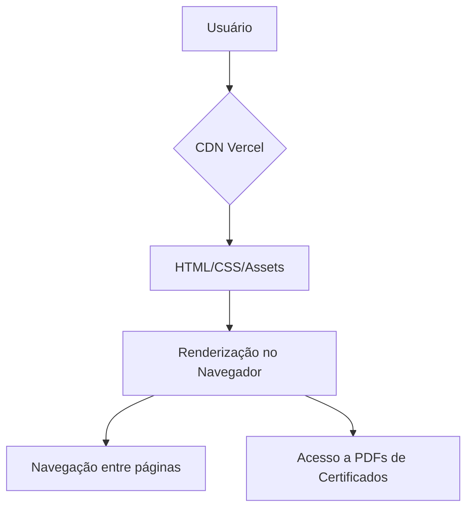

---

# 🚀 Portfólio Pessoal — José Enoque Costa de Sousa

> **Seu hub digital para conhecer minha trajetória, projetos e habilidades em desenvolvimento web.**

<div align="center">
  
</div>

---

## ⚡ Visão Rápida

| **🔗 Online**       | [Acesse aqui na Vercel 🚀](https://portifolio-sousadev97.vercel.app)                                      |
| ------------------- | --------------------------------------------------------------------------------------------------------- |
| **👤 Autor**        | José Enoque Costa de Sousa                                                                                |
| **📍 Localização**  | São Bernardo do Campo, SP - Brasil                                              |
| **🌐 Contatos**     | [LinkedIn](https://www.linkedin.com/in/enoque-sousa-bb89aa168/) • [GitHub](https://github.com/SousaDev97) |
| **🛠️ Tecnologias** | HTML5 • CSS3 (Flexbox, Variáveis) • (JS Futuro) • Git • Vercel                                            |
| **📜 Certificados** | [Veja todos na pasta `/certificados`](./certificados)                                                     |

---

## 📚 Resumo Técnico

Este projeto é um portfólio web pessoal — um artefato digital para demonstrar habilidades técnicas, trajetória e qualificações de **José Enoque Costa de Sousa**. Criado como solução para centralizar minha presença profissional de forma acessível e coesa, trata-se de um site estático moderno, responsivo e focado na clareza, feito com:

* **HTML5 semântico** para estruturação e SEO
* **CSS3 (Flexbox, variáveis)** para design limpo, responsivo e temático
* **Hospedagem Serverless (Vercel)** para alta disponibilidade e performance

Toda a jornada do aprendizado prático (cursos, graduação e experiência) se traduz aqui em um produto polido, que serve de vitrine profissional, currículo interativo e hub de certificados.

---

## 🏅 Badges


---

## 📖 Sumário

1. [Introdução e Motivação](#introdução-e-motivação)
2. [Acesso Rápido](#acesso-rápido)
3. [Arquitetura do Sistema](#arquitetura-do-sistema)
4. [Decisões de Design](#decisões-de-design)
5. [Funcionalidades](#funcionalidades)
6. [Tech Stack](#tech-stack)
7. [Estrutura de Pastas](#estrutura-de-pastas)
8. [Pré-requisitos](#pré-requisitos)
9. [Instalação Local](#instalação-local)
10. [Como Usar](#como-usar)
11. [Testes & Qualidade](#testes--qualidade)
12. [Deploy e Escalabilidade](#deploy-e-escalabilidade)
13. [Contribuições](#contribuições)
14. [Licença](#licença)
15. [Contato](#contato)
16. [FAQ](#faq)

---

## 💡 Introdução e Motivação

Em um mercado de tecnologia cada vez mais competitivo, um portfólio online é mais que um currículo — é uma prova real das habilidades, evolução e identidade do desenvolvedor. Este projeto nasceu da necessidade de apresentar, de forma personalizada e autêntica, minha jornada, conquistas e competências.

Construí tudo do zero, aplicando os conceitos fundamentais de HTML, CSS e responsividade aprendidos na graduação e nos cursos da Alura. O resultado é uma plataforma acessível, com navegação clara, que valida minhas capacidades técnicas e soft skills, e que pode crescer comigo ao longo da carreira.

---

## 🔗 Acesso Rápido

* **Deploy online:** [portifolio-sousadev97.vercel.app](https://portifolio-sousadev97.vercel.app)
* **Repositório no GitHub:** [github.com/ESousa97/Portifolio](https://github.com/ESousa97/Portifolio)

---

## 🏛️ Arquitetura do Sistema

Arquitetura **estática** e **serverless** via Vercel:

* **Cliente (navegador):** Renderiza todo o conteúdo e navegação.
* **CDN global (Vercel):** Entrega arquivos HTML, CSS, imagens e PDFs com altíssima performance.

**Fluxo:**



**Por quê essa arquitetura?**

* Simplicidade extrema e zero custo
* Altíssimo desempenho global
* Segurança máxima (sem backend exposto)
* Deploy automático e CI/CD direto do GitHub

---

## ⚖️ Decisões de Design

* **HTML5 Semântico:** Facilita acessibilidade, SEO e manutenção.
* **CSS3 + Variáveis:** Paleta de cores e tipografia centralizadas, fácil de evoluir.
* **Flexbox:** Layouts flexíveis e responsivos.
* **Sem frameworks:** Foco em mostrar domínio da base web pura antes de abstrações.
* **Design responsivo:** Acessível e bonito em qualquer dispositivo.

---

## ✨ Funcionalidades

* **Home:** Boas-vindas, missão, acesso rápido ao LinkedIn e GitHub.
* **Sobre Mim:** Biografia, história, motivações, soft skills.
* **Currículo:** Experiência, formação e links diretos para certificados (PDF).
* **Navegação Global:** Menu e rodapé presentes em todas as páginas.
* **Visual Limpo:** UI minimalista, foco na informação e acessibilidade.

---

## 🛠️ Tech Stack

| Camada        | Tecnologia           | Para quê?                       |
| ------------- | -------------------- | ------------------------------- |
| Frontend      | HTML5                | Estrutura semântica             |
| Frontend      | CSS3 (Flexbox, vars) | Layout, responsividade, theming |
| Versionamento | Git, GitHub          | Controle de versões             |
| Deploy        | Vercel               | CI/CD, hospedagem, CDN          |
| Certificados  | PDF                  | Provas reais de qualificação    |

---

## 📂 Estrutura de Pastas

```bash
Portifolio-main/
├── README.md
├── index.html
├── about.html
├── curriculo.html
├── assets/
│   ├── github.png
│   ├── linkedin.png
│   ├── perfil.png
│   └── whatsapp.png
├── certificados/
│   └── ... (PDFs dos certificados)
└── styles/
    └── Style.css
```

---

## 📋 Pré-requisitos

* **Para navegar:** Qualquer navegador moderno.
* **Para editar/contribuir:**

  * Git
  * Editor de código (VS Code recomendado; extensão Live Server facilita a visualização)

---

## 🚀 Instalação Local

1. **Clone o repositório:**

   ```bash
   git clone https://github.com/ESousa97/Portifolio.git
   ```
2. **Acesse a pasta:**

   ```bash
   cd Portifolio-main
   ```
3. **Abra o `index.html` no navegador**
   Ou use o Live Server no VS Code para hot reload.

---

## ⚙️ Como Usar

* Explore as páginas via menu.
* Confira a lista de certificados — todos clicáveis e abertos direto no navegador.
* Acesse os links para LinkedIn e GitHub para conhecer mais sobre minha atuação e projetos.

---

## 🧪 Testes & Qualidade

* Todos os links, certificados e navegação validados manualmente.
* Testes em diferentes navegadores e tamanhos de tela.
* Código validado em [W3C Markup Validator](https://validator.w3.org/).

Futuramente: adicionar linting e testes automatizados para futuras versões com JS.

---

## 🚢 Deploy e Escalabilidade

* **Deploy contínuo:** Vercel + GitHub.
* **Zero downtime:** CDN global entrega instantânea.
* **Escalabilidade automática:** Suporta quantos acessos forem necessários, sem configuração extra.

---

## 🤝 Contribuições

Este é um portfólio pessoal, mas sugestões e feedbacks são super bem-vindos!

* [Abra uma issue](https://github.com/ESousa97/Portifolio/issues)
* [Entre em contato comigo](#contato)

---

## 📜 Licença

Todo o conteúdo, imagens e estrutura são de autoria de José Enoque Costa de Sousa. O código pode ser utilizado como inspiração, mas para usos além da visualização, entre em contato.

---

## 👋 Contato

* **LinkedIn:** [enoque-sousa-bb89aa168](https://www.linkedin.com/in/enoque-sousa-bb89aa168/)
* **E-mail:** [sousa3086@outlook.com](mailto:sousa3086@outlook.com)

---

## ❓ FAQ

**Posso usar esse código para meu próprio portfólio?**

> Pode usar como inspiração, mas recomendo adaptar e personalizar com seu próprio código e estilo.

**Você domina só as tecnologias listadas?**

> Não! Sigo aprendendo constantemente. Veja minha lista de certificados e perfil no LinkedIn para um panorama mais completo.

**Está aberto a oportunidades ou freelas?**

> Sim! Me chame pelo LinkedIn ou e-mail para conversarmos sobre parcerias e projetos.

---

<div align="center">

Feito com dedicação por <strong>José Enoque Costa de Sousa</strong> 💻

</div>

> ✨ Projeto Criado em: 7 de abr. de 2023 às 21:20

---

